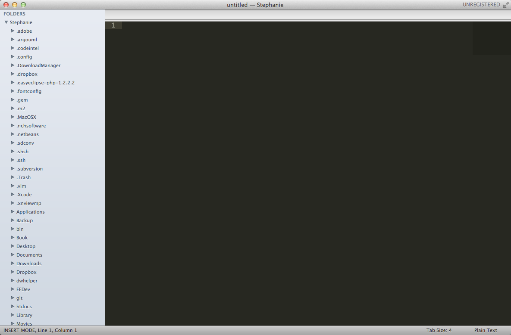
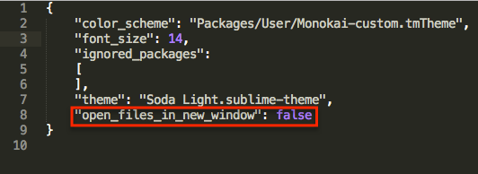

http://wesbos.com/sublime-text-2-tips/

* <a href="#1">1. 从终端开启Sublime</a>
* <a href="#2">2. 在当前窗口中打开Sublime</a>
* <a href="#3">3. 如何创建Snippet</a>

# 3个Sublime Text 2的小技巧

## <a name="1">1. 从终端开启Sublime</a>

如果你经常会用到bash，下面的方法对你来说可能会节省不少时间。一条命令行便能打开一个文件或者文件夹。

首先在终端中运行下面的代码，创建subl符号链接：

	sudo ln -s "/Applications/Sublime Text 2.app/Contents/SharedSupport/bin/subl" /bin/subl

在终端中运行下面命令，可以快速打开你的home目录。

	cd ~
	subl .

上述语句，打开整个文件夹:

使用以下语句，可以快速在当前窗口中打开文件，而将焦点继续保持在终端。这对于要同时切换到不同目录下，打开多个文件和有用。

	cd ~
	subl -ab 1.txt

*参数*

* –-project <project>: 加载指定的项目
* –-command <command>: 运行指定的命令
* -n 或 --new-window: 打开新的窗口
* -a 或 --add: 增加新的目录到现有的窗口
* -w 或 --wait: 关闭文件之后，终端的语句才能返回
* -b 或 --background: 保持焦点还在终端，不切换到Sublime Text 2
* -s 或 --stay: 关闭文件之后，保持焦点在Sublime Text 2
* -h 或 --help: 显示帮助
* -v 或 --version: 显示版本信息
 
## <a name="2">2. 在当前窗口中打开Sublime</a>

This was one of the biggest annoyances for me when switching over from coda. Whenever I would drag a file into the sublime dock icon it would open a brand new instance of sublime when I just wanted to view it along with the rest of my files. Turns out this is a super simple fix.

你是否发现将文件拖到Dock上Sublime图标的时候，它会自动打开一个新的窗口呢？而你想要的是在当前已有的窗口中打开那个文件。

点击`Command + Shift + P`(Mac)或`Ctrl + Shift + P`，找到"Preferences: Settings - User"，然后加入：

	"open_files_in_new_window": false

## <a name="3">3. 如何创建snippet</a>

有时你需要重复输入某个代码片段，不如让Sublime来帮你自定义一个你经常使用的代码片段吧。

首先点击`Tools -> New Snippet...`，你会见到一个实例：

	<snippet>
		<content><![CDATA[
	Hello, ${1:this} is a ${2:snippet}.
	]]></content>
		<!-- Optional: Set a tabTrigger to define how to trigger the snippet -->
		<!-- <tabTrigger>hello</tabTrigger> -->
		<!-- Optional: Set a scope to limit where the snippet will trigger -->
		<!-- <scope>source.python</scope> -->
	</snippet>

已经解释得很清楚了，你只需要定义`![CDATA[`和`]]`之间的内容。

`${1:this}`代表`${序号:默认值}`，编辑完一个序号的内容后，点击`Tab`键会跳到后一个序号定义的位置。

`<tabTrigger></tabTrigger>`则是定义你想在输入什么内容后，点`Tab`键触发生成代码片段。

`<scope></scope>`是指定在什么文件中输入代码片段。

好了，假设我们要添加一段jQuery的常用代码，点击`Tools -> New Snippet...`，

	<snippet>
	    <content><![CDATA[
	    	\$('${1}')${2};
	    ]]></content>
	    <tabTrigger>j</tabTrigger>
	</snippet>

将文件保存为到`/Users/<你的用户名>/Library/Application\ Support/Sublime\ Text\ 2/Packages/`，这个文件夹的内容是用户自定义的内容，重新安装之后不会被覆盖，文件后缀存成`.sublime-snippet`。然后在文件中输入`j`，再按`Tab`键，便会展开成如下代码，光标自动放在序号1定义的地方。

	$('');

