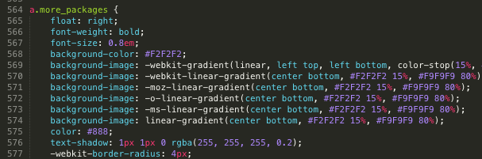
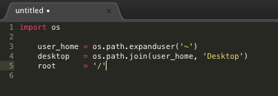
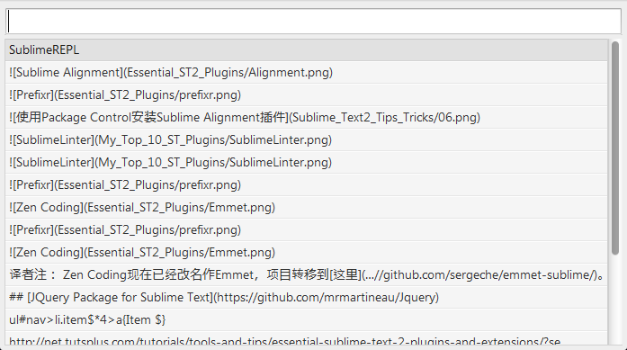
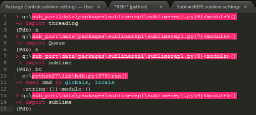
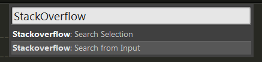

原文链接：[http://net.tutsplus.com/tutorials/tools-and-tips/essential-sublime-text-2-plugins-and-extensions/?search_index=6](http://net.tutsplus.com/tutorials/tools-and-tips/essential-sublime-text-2-plugins-and-extensions/?search_index=6)

# 必备的Sublime Text 2插件

Sublime Text 2是我用了一段时间的一个比较新的编辑器。它发布的仍旧还是beta版，但已经提供了很多功能和良好性能，让我不再使用一度最信任的Komodo，转而使用Sublime Text 2。

我非常喜欢现在已有的功能了，但就像生命中大部分的事物一样，没有最好，只有更好。由于Sublime Text 2的可扩展性，一个围绕它衍生出来的大型生态圈已经形成。Sublime Text 2可以满足你大部分的开发需求，不论是一般的需求还是稀奇古怪的要求。现在，我想分享一下我认为很有用的插件。可能不是所有的插件对你来说都很有用，至少你会发现一两个插件，能够帮你显著提高工作效率。

## [Zen Coding](https://bitbucket.org/sublimator/sublime-2-zencoding)

> Zen Coding能让年快速的写出HTML代码。它的核心是个强大的缩写引擎，能让你快速的将类似于CSS选择器的表达式快速扩展成HTML代码。

*译者注：* Zen Coding现在已经改名作Emmet，项目转移到[这里](https://github.com/sergeche/emmet-sublime/)。

## [JQuery Package for Sublime Text](https://github.com/mrmartineau/Jquery)

> 离开了jQuery，我们的生活将会多艰难？！这个插件兴许能帮上忙。

## [Sublime Prefixr](https://github.com/wbond/sublime_prefixr)

> Sublime Prefixr通过Prefixr API对CSS代码进行前缀补全。这个插件是Nettuts的Jeffrey Way为Sublime Text 2开发的。

## [JS Format](https://github.com/jdc0589/JsFormat)

> JsFormat是个Javascript代码格式化插件。它采用的是来自JS Beautifier的命令行/python模块的javascript格式化器来格式化选中的代码，如果你没有选中任何代码的话，它会格式化整个文件。

## [SublimeLinter](https://github.com/kronuz/SublimeLinter/)

> SublimeLinter支持lint程序(也叫做"linter")。SublimeLinter会高亮选中linter认为是错误的代码。它也支持高亮特别的注释，这样就方便快速定位。

## [Placeholders](https://github.com/mrmartineau/Placeholders)

> 我经常觉得插入占位符或是某个内容是项非常繁琐的事情。有了这个插件，你可以很容易的插入占位符和HTML了。

## [Sublime Alignment](https://github.com/wbond/sublime_alignment)

>  我非常推崇良好的代码格式。我们要做的一件事情便是要对齐所有的变量赋值语句，这样让它们看起来干净整洁。有了Sublime Alignment，你只需要按下一个键，便能轻松帮你对齐多行语句。

## [Clipboard History](https://github.com/kemayo/sublime-text-2-clipboard-history)

> 在编程马拉松比赛中，你是否非常痛恨不得不替换掉剪切板中的内容呢？这个插件可以帮你保存剪切板的历史，随时随地可以粘贴你想粘贴的内容。

## [SublimeREPL](https://github.com/wuub/SublimeREPL)

> SublimeREPL让你轻松运行你最喜欢的解释器。它支持Python和Ruby。

## [DetectSyntax](https://github.com/phillipkoebbe/DetectSyntax)

> DetectSyntax帮你正确确定文档的syntax。当你使用自定义的文档格式时(譬如模板文件中要使用的文档)，这个插件尤其有用。

## [Nettuts Fetch](https://github.com/weslly/Nettuts-Fetch)

> Nettuts Fetch帮你下载某个文件最新的版本，仅仅动一下手指敲个快捷键便可以做到，它会向你设定的URL发出curl请求。对于新的项目来说，它非常有用，因为你使用的都是最新的版本。

## [JsMinifier](https://github.com/cgutierrez/JsMinifier)

> 将文件优化到最小大小，再部署到服务器是一种很好的实践。这个插件采用Goolgle Closure编译器来最小化你的JavaScript代码。

## [Sublime CodeIntel](https://github.com/Kronuz/SublimeCodeIntel)

> SublimeCodeIntel是一个代码智能化插件，源自Open Komodo编辑器。它能提供自动补全的信息，也可以将目前工作的函数的简单信息显示在状态栏中。推荐！

## [Tag](https://github.com/SublimeText/Tag)

> 如果你正在做一些页面结构(markup)相关的工作。Tag搜集了很多标记，能够预测标签。想要用一个“/”结束一个标签吗？想要自动缩进标签吗？安装它吧！

## [Bracket Highlighter](https://github.com/facelessuser/BracketHighlighter)

> 这个插件可以根据括号来折叠代码。

## [Case Conversion](https://github.com/jdc0589/CaseConversion)

> 你遇到过不遵守命名习惯的糟糕同事吗？[Case Conversion](https://github.com/jdc0589/CaseConversion)采用三种最常用的命名规则来转换命名。

## [Stackoverflow Search](https://github.com/ericmartel/Sublime-Text-2-Stackoverflow-Plugin)

> StackOverflow真是我的好帮手，帮我节省了很多时间，我已经说不清我在它上面找到答案的次数了。这个插件能让你迅速的在编辑器中找到答案。

## [Sublime Guard](https://github.com/cyphactor/sublime_guard)

> 还记得Jeffrey在他的[Rails教程](http://net.tutsplus.com/tutorials/ruby/the-intro-to-rails-screencast-i-wish-i-had/)中使用了一个叫作Guard的东西吗？这个插件为控制Guard以及查看Guard的输出提供了无缝的接口。

## [Git](https://github.com/kemayo/sublime-text-2-git)

> 这个小插件让你在Sublime Text中使用大部分常用的Git命令。而且用Sublime Text 2来查看Diff结果是件非常舒心的事情！

## [Sublime Change Quotes](https://github.com/colinta/SublimeChangeQuotes)

> 这个插件转换单引号和双引号，但是保持正确的escape。

## [Hex to HSL](https://github.com/atadams/Hex-to-HSL-Color)

> 你是否已经厌倦了频繁的将颜色的Hex码转换成HSL？这个插件能帮你自动转换，你只需按下`Shift + Ctrl + U`。

## 结论

好了，这就是我日常用的插件了。但是Sublime Text 2的社区如此活跃，我肯定遗漏了很多好插件。请在留言中留下你觉得好用的插件吧！