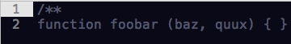
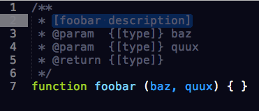
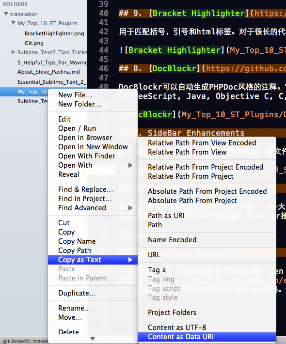
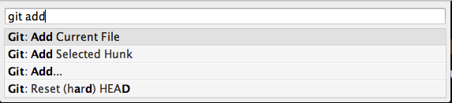
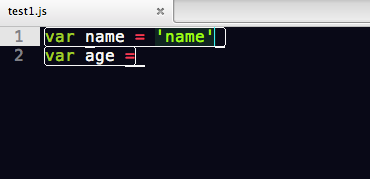
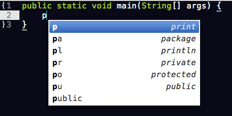
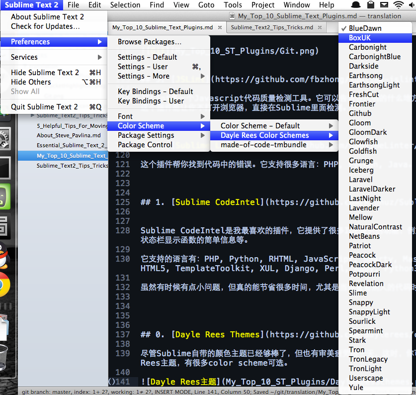

# 开发人员常用的10个Sublime Text插件

整理自：[henriquebarroso.com](http://www.henriquebarroso.com/my-top-10sublime-2-plugins/)

[Sublime](http://www.sublimetext.com/)是一个新兴的文本编辑器，它的轻巧和功能强大已经吸引了大批的程序员，目前它还是beta版本，但它的社区和插件的开发都非常活跃。它还有插件提供VIM的支持，连我这么多年的VI死忠粉都开始倒戈。但没有最好，只有更好，期待Sublime持续的开发给我们带来新的惊喜。

这个列表列出了十个插件，推荐给前端开发人员。

## 10. [Package control](http://wbond.net/sublime_packages/package_control)

[Package control](http://wbond.net/sublime_packages/package_control)是必装插件，所有其他的插件和主题都可以通过它来安装。希望它能出现在正式版默认包中。

首先参照下面的[教程](http://www.ladyloveit.com/archives/130)来安装Package Control：

- [如何安装Package control](http://www.ladyloveit.com/archives/130#InstallPackageControl)

## 9. [Bracket Highlighter](https://github.com/facelessuser/BracketHighlighter)

用于匹配括号，引号和html标签。对于很长的代码很有用。安装好之后，不需要设置插件会自动生效。

## 8. [DocBlockr](https://github.com/spadgos/sublime-jsdocs)

DocBlockr可以自动生成PHPDoc风格的注释。它支持的语言有Javascript, PHP, ActionScript, CoffeeScript, Java, Objective C, C, C++。

### 使用方法

按下`Enter`或者`Tab`键，代码自动变成

## 7. [SideBar Enhancements](https://github.com/titoBouzout/SideBarEnhancements)

这个插件改进了侧边栏，增加了许多功能：将文件移入回收站，在浏览器中浏览，将文件复制到剪切板。

## 6. [Prefixr](http://wbond.net/sublime_packages/prefixr)

由于CSS3和HTML5的W3C规范都尚未统一，各大浏览器对标准的支持还是有差异的。所以在编写CSS3代码还需要针对不同的浏览器写一堆的CSS3代码前缀。Prefixr插件能将CSS3代码自动生成跨浏览器CSS代码。

### 使用方法

   .box {
      border-radius: 10px;
      box-shadow: 0 0 5px rgba(0,0,0,.4);
   }

按下`control + command + X`（Mac）或者 `ctrl + Alt + X`（Windows），会转换成：

   .box {
      -webkit-border-radius: 10px;
      -moz-border-radius: 10px;
      border-radius: 10px;
    
      -webkit-box-shadow: 0 0 5px rgba(0,0,0,.4);
      -moz-box-shadow: 0 0 5px rgba(0,0,0,.4);
      box-shadow: 0 0 5px rgba(0,0,0,.4);
   }

## 5. [Emmet(Zen Coding)](https://github.com/sergeche/emmet-sublime)

大名鼎鼎的[Zen Coding](https://github.com/sergeche/zen-coding)改名作Emmet啦，Zen Coding的Sublime Text 2插件也不再更新，现在整个项目搬到了[Emmet](https://github.com/emmetio/emmet)了。仅仅需要一行代码就能快速生成html代码。

	ul#nav>li.item$*4>a{Item $}

你只需要按下`control + E`，代码就会自动展开成：

	<ul id="nav">
		<li class="item1"><a href="">Item 1</a></li>
		<li class="item2"><a href="">Item 2</a></li>
		<li class="item3"><a href="">Item 3</a></li>
		<li class="item4"><a href="">Item 4</a></li>
	</ul>

还没试过的童鞋一定要试一下，体验一下Emmet的神奇功能吧。

## 4. [Git](https://github.com/kemayo/sublime-text-2-git/wiki)

Git是我最喜欢的版本控制系统，如果你每天要使用Git，那这个插件对你来说必不可少了。

使用Package Control下载后，你只需要调出命令面板，输入Git，便能找到所有常用的功能。

## 3. [JSLint](https://github.com/fbzhong/sublime-jslint)

JSLint是一个Javascript代码质量检测工具。它可以告诉你代码的什么地方需要改进。虽然你也可以在网上检测，但这个插件能让你不打开浏览器，直接在Sublime里面检测。

### 使用方法

按下`Shift + Command + P`(Mac)或是`Shift + Ctrl + P`(Windows)调出命令面板，找到`JSLint: Run JSLint`，按下`Enter`，JSLint会输出结果到状态栏。

## 2. [Sublime Linter](https://github.com/SublimeLinter/SublimeLinter)

这个插件帮你找到代码中的错误。它支持很多语言：PHP, Python, Java, CoffeScript, CSS, HTML, JavaScript, Perl, PHP, Python, Ruby, XML等。Javascript需要安装Node.js引擎，其他配置详见项目主页。强烈推荐安装。

## 1. [Sublime CodeIntel](https://github.com/Kronuz/SublimeCodeIntel)

Sublime CodeIntel是我最喜欢的插件，它提供了很多IDE提供的功能，例如代码自动补齐，快速跳转到变量定义，在状态栏显示函数快捷信息等。

它支持的语言有：PHP, Python, RHTML, JavaScript, Smarty, Mason, Node.js, XBL, Tcl, HTML, HTML5, TemplateToolkit, XUL, Django, Perl, Ruby, Python3.

虽然有时候有点小问题，但真的能节省很多时间。强烈推荐安装。

## 0. [Dayle Rees颜色主题](https://github.com/daylerees/colour-schemes)

尽管Sublime自带的颜色主题已经够棒了，但也有审美疲劳的一天，这时，你可以下载Dayle Rees主题，有多款主题可选。

