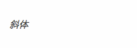
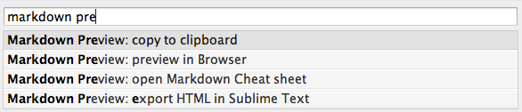
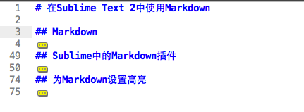
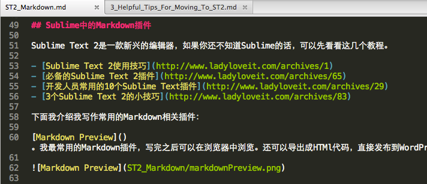

# 在Sublime Text 2中使用Markdown

## Markdown简介

如果你像我一样，需要发布文章到WordPress，你就知道从Word中粘贴带有格式的文章到WordPress是有多么的麻烦，粘贴到WordPress中的格式不一定是你想要的，尤其是代码和文字缩进，更改文件的格式的确会打击你写作的积极性。

今天要介绍的是Markdown，一款文本标记语言，使用简单的语法，便能给文件编辑出漂亮的格式。如果你经常和文字打交道的话，不管是博主还是作家，你一定要学习Markdown，二十分钟的学习过程真的会为你节省大量的时间！Markdown让你将精力能集中在写作上，不再为编辑格式而操心了。

首先，新建一个`.md`或者`.markdown`为后缀的文件名，输入

	*斜体*

转换成HTML代码，会转换成:

	<b>斜体</b>

最终看到的效果会是这样：

你也不需要懂得HTML代码是怎样写的，你只用记得简单的Markdown语法，有软件会自动帮你转换成HTML代码。再看几个简单的例子：

	[超链接](http://www.google.com.hk)

	会变成:

	<a href="http://www.google.com.hk">超链接</a>

	# 标题一

	会变成：

	<h1>标题一</h1>

	## 标题二

	会变成

	<h2>标题二</h2>

更多Markdown语法请看：[Markdown语法说明中文版](http://wowubuntu.com/markdown/)

## Sublime中的Markdown插件

Sublime Text 2是一款新兴的编辑器，如果你还不知道Sublime的话，可以先看看这几个教程。

- [Sublime Text 2使用技巧](http://www.ladyloveit.com/archives/1)
- [必备的Sublime Text 2插件](http://www.ladyloveit.com/archives/65)
- [开发人员常用的10个Sublime Text插件](http://www.ladyloveit.com/archives/29)
- [3个Sublime Text 2的小技巧](http://www.ladyloveit.com/archives/83)

下面我介绍我写作常用的Markdown相关插件：

[Markdown Preview](https://github.com/revolunet/sublimetext-markdown-preview)。我最常用的Markdown插件，写完之后可以在浏览器中浏览。还可以导出成HTMl代码，直接发布到WordPress中。

[SmartMarkdown](https://github.com/demon386/SmartMarkdown)。 如果在某个标题上按`Tab`键，它可以帮你折叠这个标题下的内容。而在文档的任何一个位置按下`Shift + Tab`，会折叠起来整个文档。这对分章节的长文档很有用。按下`Control + C`然后按`Control + N`能跳转到下一个标题，按下`Control + C`然后按`Control + P`能跳转到下一个标题。更多功能请参考：[SmartMarkdown 主页](https://github.com/demon386/SmartMarkdown)

[MarkdownEditing](https://github.com/ttscoff/MarkdownEditing)。为Markdown和MultiMarkdown提供了许多快捷键，例如：`Command + Option + K` 插入链接；`Command + Shift + K`插入图片。

## 配置Markdown语法高亮

Sublime Text 2自带的就有许多很好看的颜色主题。但个人比较喜欢这款[配色](http://immmmm.com/sublime-text-2-uses-markdown-small-notes.html)

下载文件: [Monokai-custom.tmTheme]()

放到`/Users/<你的用户名>/Library/Application\ Support/Sublime\ Text\ 2/Packages/`文件夹下，在`Preferences -> Color Scheme -> User`选择`Monokai-custom`。

