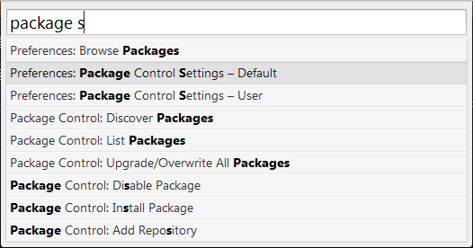
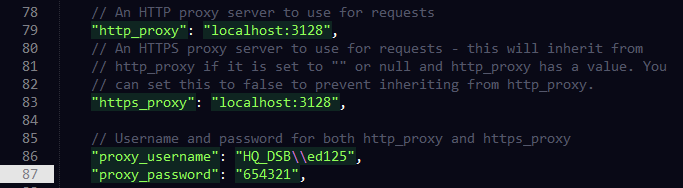

# Sublime Text 2设置代理

如果你的公司设置了代理，那你这时需要设置一下，让Sublime Text 2的使用代理。

首先参照下面的[教程](http://www.ladyloveit.com/archives/130)安装Package Control：

- [如何安装Package control](http://www.ladyloveit.com/archives/130#InstallPackageControl)

## Package Control设置代理

安装好Package Control之后，下一步是设置Package Control，让它使用代理。

点击>Preferences > Package Settings > Package Control > Settings Default，或者按下快捷键`Command + Shift + P`(Mac)或是`Ctrl + Shift + P`(Windows)，找到`Preferences: Package Control Settings - Default`

搜索proxy部分，设置你的代理设置：

## 使用Package Control

以安装`Sublime Alignment`为例：

- 按下`Shift + Command + P` (Mac)或者`Shift + Ctrl + P`(Windows)调出命令面板
- 输入`install`，你会见到`Package Control: Install Package`，选中它按下Enter
- 找到"Alignment"，按下Enter安装它
- 完成了，就这么简单！然后按下`Shift + Command + A`(Mac)或者`Ctrl + Alt + A`(Windows)来进行自动对齐吧。

