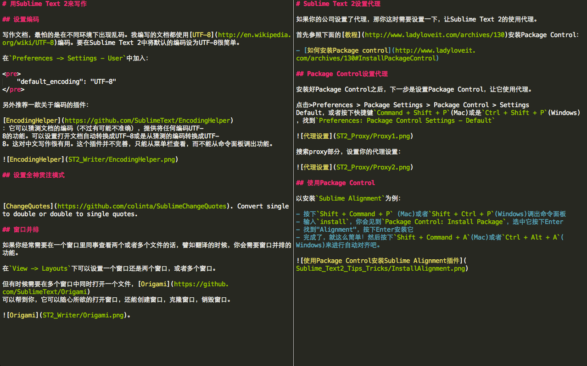
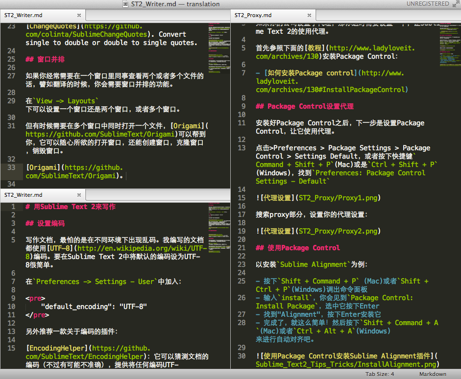

# 用Sublime Text 2来写作

## 设置编码

写作文档，最怕的是在不同环境下出现乱码。我编写的文档都使用[UTF–8](http://en.wikipedia.org/wiki/UTF-8)编码。要在Sublime Text 2中将默认的编码设为UTF-8很简单。

在`Preferences -> Settings - User`中加入：

	"default_encoding": "UTF-8"

另外推荐一款关于编码的插件：

[EncodingHelper](https://github.com/SublimeText/EncodingHelper)：它可以猜测文档的编码（不过有可能不准确），提供将任何编码UTF-8的功能。可以设置打开文档自动转换成UTF-8或是从猜测的编码转换成UTF-8。这对中文写作很有用。这个插件并不完善，只能从菜单栏查看，而不能从命令面板调出功能。

## 设置全屏模式

写作时，我们希望不受干扰，这时我们可以使用全屏模式。点击View -> Enter Distraction Free Mode，或者使用`Control + Shift + Command + F`(Mac)或是`Shift + F11`(Windows)。

## 窗口并排

如果你经常需要在一个窗口里同事查看两个或者多个文件的话，譬如翻译的时候，你会需要窗口并排的功能。

在`View -> Layouts`下可以设置一个窗口还是两个窗口，或者多个窗口。

但有时候需要在多个窗口中同时打开一个文件，[Origami](https://github.com/SublimeText/Origami)可以帮到你，它可以随心所欲的打开窗口，还能创建窗口，克隆窗口，销毁窗口。

。

## 使用Markdown

关于Markdown以及相关插件详见这篇:

- [在Sublime Text 2中使用Markdown](http://www.ladyloveit.com/archives/95)
