原文链接： [http://net.tutsplus.com/tutorials/tools-and-tips/sublime-text-2-tips-and-tricks/](http://net.tutsplus.com/tutorials/tools-and-tips/sublime-text-2-tips-and-tricks/)

# Sublime Text 2使用技巧

[Sublime Text 2](http://www.sublimetext.com/dev)无疑是世界上最快的，最好用的代码编辑器之一！Sublime Text 2的社区以及插件更新都非常的活跃，对于其他编辑器来说很难超越。今天我会介绍我最喜欢的使用技巧。

> 所有的主流系统(OS X, Linux, Windows)都能下载到[Sublime Text 2](http://www.sublimetext.com/)。

## 1 - 下载最新版本

Sublime的开发非常活跃。如果你像我一样，想要使用最新版本，你可以下载[dev版](http://www.sublimetext.com/dev)。它每隔几天就有新的更新。

> 在[这里](http://www.sublimetext.com/dev)下载Sublime 2的dev版。

## 2 - 使用更漂亮的图标

> [这里](https://github.com/dmatarazzo/Sublime-Text-2-Icon)有更漂亮的图标。

Sublime Text 2仍然是beta版。希望在官方发布的正式版本中，图标会有所改变。现在，[Nate Beaty](http://natebeaty.com/)做了一个新的[图标](http://www.sublimetext.com/forum/download/file.php?id=200)，你喜欢的话就替换它吧。

用[新的图标](http://www.sublimetext.com/forum/download/file.php?id=200)替代原有的`Sublime Text 2.icns`。Mac上，打开`Applications`文件夹找到Sublime Text 2，右键点选并选择`View Package Contents`，进入`Contents/Resources/`目录，将新的图标放进去替换掉原有图标。

> 请注意，如果你用的是经常更新的[dev](http://www.sublimetext.com/dev)版，每次更新都会将图标覆盖掉。

## 3 - 使用命令面板(Command Palette)

同TextMate类似，点击Tools -> Command Palette(命令面板)，或者按下快捷键`Shift + Command + P`(Mac)或是`Shift + Ctrl + P`(Windows)。当你需要浏览`Preperences`(选项)或者需要粘贴一段代码(snippet)，你都可以使用这个命令。

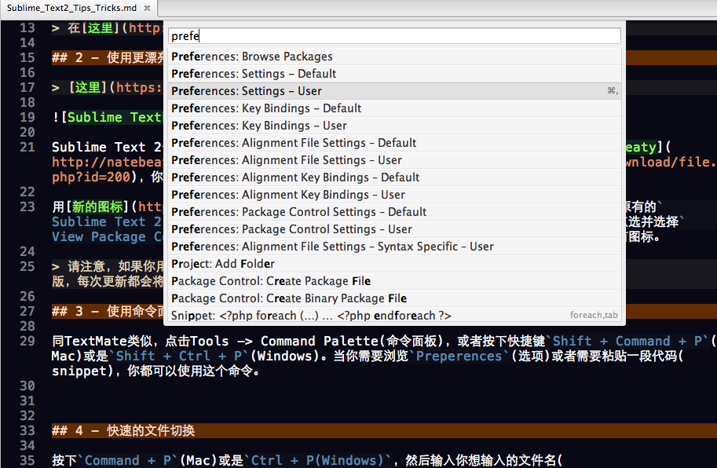

## 4 - 快速的文件切换

按下`Command + P`(Mac)或是`Ctrl + P(Windows)`，然后输入你想输入的文件名(不需要精确搜索，仅需要输入其中的几个字符就可以了)，你都不需要按下回车，你就能找到那个文件了。虽然Vim和PeepOpen也提供了类似的功能，但都没有Sublime这么快。

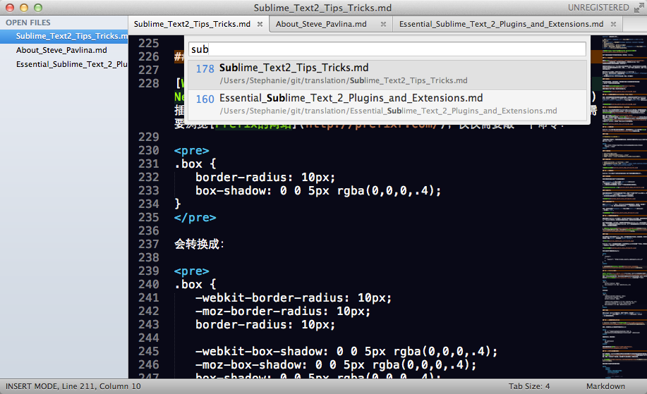

## 5 - 多重选择(Multi-Selection)

TextMate等编辑器已经很早就实现了竖行选择(vertical selection)，这个功能很棒。但有了多重选择(multi-selection)，你可以在一个页面有多重光标，这样让原本需要正则表达式、高级搜索和替换才能完成的任务变得简单易行了。看一个视频来快速了解多重选择吧：

*TODO:视频*

激活多重选择几种方法：

- 按住 `Command`(Mac)或是　`Ctrl`(Windows)，然后在页面中希望有光标的位置点击。
- 选择数行文本，然后按下 `Shift + Command + L`(Mac) 或者 `Shift + Ctrl + L`(Windows) 。
- 先选中一个字，通过反复按下 `Command + D` (Mac)或是`Ctrl + D`(Windows)即可将全文中与光标当前所在位置的词相同的词逐一加入选择。
- 直接按下 `Control　+　Command + G`(Mac) 或是　`Alt + F3`(Windows) 可一次性选择所有相同的词。不可思议吧！

## 6 - 缩进指引

*Sublime Text 2现在已经自带这个功能了，不需要另外再安装插件。*

这虽然是一个很小的功能，但我非常喜欢Windows下的Notepad++显示的缩进指引。它使得页面更容易浏览和格式化。Sublime Text 2通过[Nikolaus Wittenstein](https://github.com/SublimeText/IndentGuides)的插件来实现这个功能。

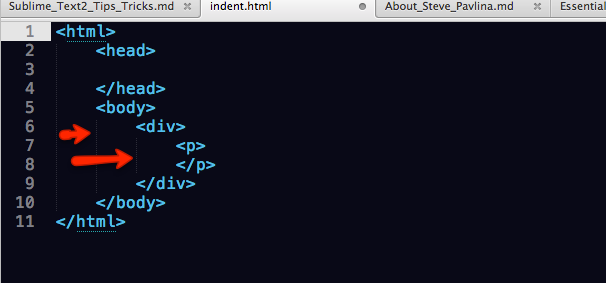

要集成这个插件：

- 从[这里](https://github.com/SublimeText/IndentGuides)下载
- 将文件夹重命名为`Indent Guides`，放到`Packages`文件夹下。Mac系统在`Application Support/Sublime Text 2/Packages`下。

## 7 - Package Control

第6步的做法有点繁琐，但我们可以用Sublime的[Package Control](http://wbond.net/sublime_packages/package_control)帮我们改进这个繁琐的过程。

要安装"Package Control"，打开Sublime，按下`Control + `(Mac)` 或者`Ctrl + `(Windows)`，然后粘贴上下面的代码：

	import urllib2,os;pf='Package Control.sublime-package';ipp=sublime.installed_packages_path();os.makedirs(ipp) if not os.path.exists(ipp) else None;open(os.path.join(ipp,pf),'wb').write(urllib2.urlopen('http://sublime.wbond.net/'+pf.replace(' ','%20')).read())

如果你看不懂粘贴的代码，也不要担心，放心的拷贝粘贴吧！

然后重启Sublime Text，点击Preferences -> Package Settings。如果安装成功了，Package Control会出现在菜单里。

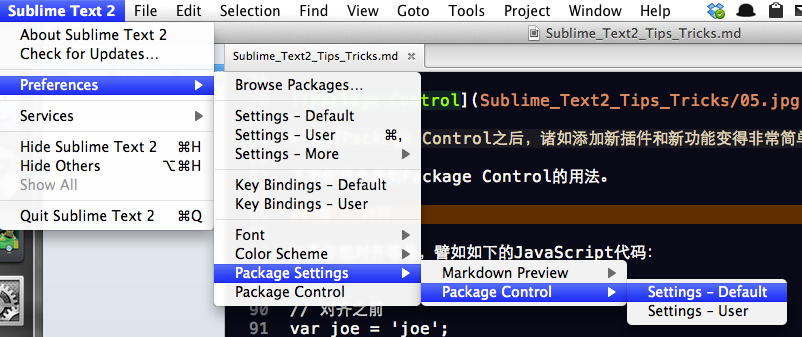

> 装好Package Control之后，诸如添加新插件和新功能变得非常简单了！

下面你将会看到Package Control的用法。

## 8 - 对齐

如果你想对齐等号，譬如如下的JavaScript代码：

	// 对齐之前  
	var joe = 'joe'; 
	var johnny = 'johnny'; 
	var quaid = 'quaid';
	 
	// 对齐之后
	var joe    = 'joe';
	var johnny = 'johnny';
	var quaid  = 'quaid';

对齐动作可以由[Sublime Alignment](http://wbond.net/sublime_packages/alignment)插件来完成。这次我们不再使用下载手动安装的方法了，我们来使用`Package Control`（参见第7小节）。

- 按下`Shift + Command + P` (Mac)或者`Shift + Ctrl + P`(Windows)
- 输入`install`，你会见到`Package Control: Install Package`，选中它按下Enter
- 找到"Alignment"，按下Enter安装它
- 完成了，就这么简单！然后按下`Shift + Command + A`(Mac)或者`Ctrl + Alt + A`(Windows)来进行自动对齐吧。

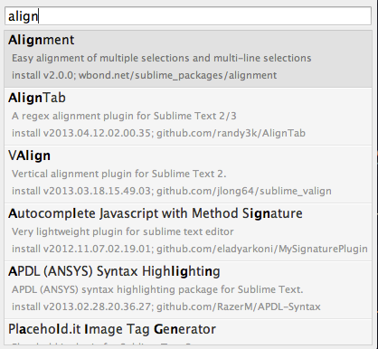

这个安装过程适用于所有插件的安装，譬如Zen Coding。

## 9 - Vim支持

我是[Vim](http://net.tutsplus.com/sessions/vim-essential-plugins/)的超级粉丝，它的功能异常强大。我转用Sublime Text 2的原因可能要占用很长的篇幅，暂时不说了。

如果你正在用Sublime Text的dev版(参见第2小节)，你可以开启Vintage模式，它提供了我们熟知和热爱的Vi命令，好吧。。。只有一部分人热爱它们，另外一些人讨厌这些命令！

要开启Vintage模式，点击Preferences -> Settings - Default。当文件打开后，在最底部找到`"ignored_packages": ["Vintage"]`，改成`"ignored_packages": []`。然后重启Sublime，按下Escape键，哈哈，命令模式！

### 块光标

你可能会注意到，在命令模式，很难找到光标(尤其如果使用书签功能)。我不止一次找不到光标的位置。

但有个插件[SublimeBlockCursor](https://github.com/netpro2k/SublimeBlockCursor)帮我们解决了这个问题，暂且作为权宜之计。

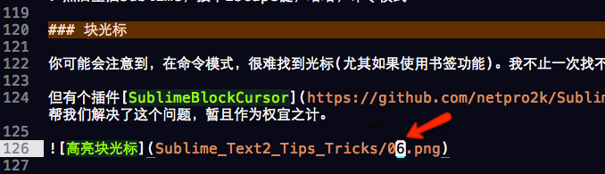

## 10 - 全神贯注模式(Distraction Free Mode)

有时，我们需要屏蔽所有阻碍我们编码的事情，这时我们可以使用"Distraction Free Mode"。点击View -> Enter Distraction Free Mode，或者使用`Control + Shift + Command + F`(Mac)或是`Shift + F11`(Windows)。

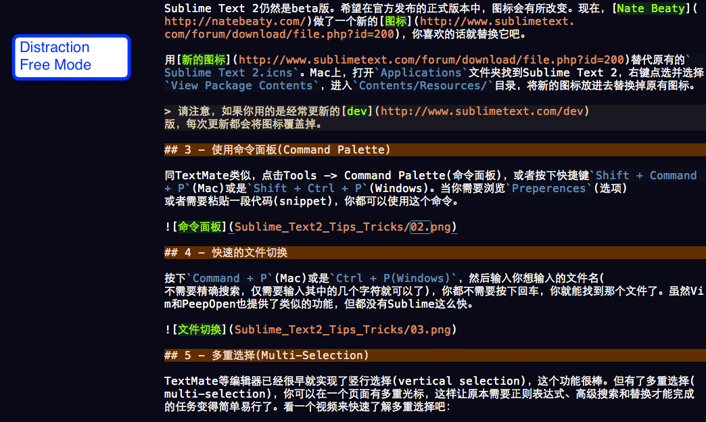

## 11 - 你仍旧可以使用TextMate  Bundles

Sublime Text非常好的兼容了TextMate的snippets和主题。你需要做的是将.tmbundle文件放在Packages文件夹下，Sublime会识别这些文件。这意味着[TextMate主题](http://textmatetheme.com/)可以运行在Sublime上。

譬如，我一直用[Slim](http://slim-lang.com/)模板引擎，并且需要代码高亮。[Fred Wu](http://fredwu.me/)为TextMate创建了一个bundle，哈哈，现在它也可以使用在Sublime上。所以如果你需要的话，你可以在[这里](https://github.com/fredwu/ruby-slim-tmbundle)下载Slim bundle，它包含一些snippets和代码高亮。

## 12 - 定制主题

Sublime Text默认的主题已经很漂亮了，但我更喜欢Ian Hill制作的[Soda](https://github.com/buymeasoda/soda-theme)的黑白主题。

### 安装

*下面摘抄自Github的页面：*

“如果你是git的用户，想要安装最新的主题，最好的方法就是在Packages目录下直接clone repo”。

	git clone https://github.com/buymeasoda/soda-theme/ "Theme - Soda"

### 手动安装

- 在Github下载zip文件
- 解压缩，并重命名文件夹为“Theme – Soda”
- 将整个“Theme – Soda”文件夹放在Sublime的Packages目录下。

### 激活主题

- 点击Preferences -> Settings - User
- 增加或者修改theme节点，改成`"theme": "Soda Light.sublime-theme"`或者`"theme": “Soda Dark.sublime-theme"`。

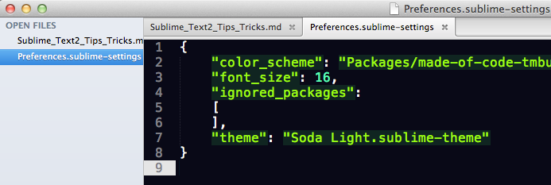

## 13 - 页面定位

Sublime Text提供了几种方法来定位页面（除了标准的搜索功能以外）。

### 定位函数

你是否想要快速定位某个方法或者函数呢?

按下`Command + R`(Mac)或者`Ctrl + R`(Windows)，你将会看到一个弹出的框（出现`@`）。更棒的是它是模糊搜索，这对于一个很大的类而言非常有用。

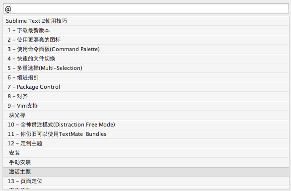

### 定位HTML

如果你想快速定位一个HTML页面的某个部分，譬如一个应用了某个class的div。按下`Command + P`(Mac)或者`Ctrl + P`(Windows)，然后在弹出的框里输入#，你将立即看到整个文档的结构。

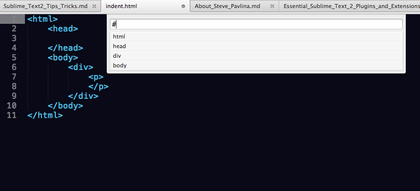

### 直接跳到某一行

使用`Control + G`(Mac, Windows)可以快速跳到某行。注意到，当你按下`Control + G`时，弹出的对话框里会出现`:`。这是沿用Vim的习惯。

另外，你也可以按下`Command + P`(Mac)或者`Ctrl + P`(Windows)，然后输入`:行号`。

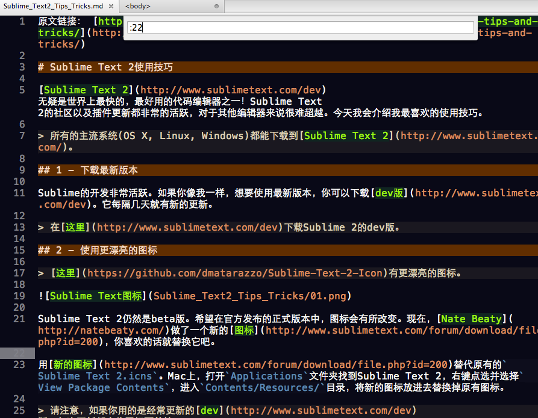

## 14 - 快速获取远端文件

假设你是Normalize.css的用户，你下载了它并作为snippet保存，或者将样式存入一个asset文件夹中。这样将来你需要的时候，你要做的只是复制粘贴。

这个方法的问题是，几个月后，创建者可能会更新Normalize.css。那么你有两个选择，一个是继续使用老版本的Normalize，另一个选择是重新到Github页面下载新版本。这样做显然很繁琐。

> [Weslly Honorato](https://github.com/weslly)制作的Nettuts+ Fetch可以解决我们这个问题，它可以使用[Package Control](http://wbond.net/sublime_packages/package_control)来安装。

### 用法

你只需要两个命令来操作Fetch。首先，我们需要保存文件引用。还是照常，打开命令面板，搜索`Fetch`，然后选择`Fetch: Manage`。

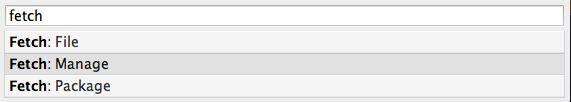

Sublime Text 2的设置非常简单，你只需要为asset文件设置一个引用。不要担心，安装之后，你已经有一个例子可以参照了。

你可以这样下载最新的jQuery：

	{
	   "files":
	   {
	      "jquery": "http://code.jquery.com/jquery.min.js"
	   }
	}

> 点击这里学习[Nettuts+ Fetch](http://net.tutsplus.com/articles/news/introducing-nettuts-fetch/)更多的知识。

## 15 - Prefixr插件

[Will Bond](http://wbond.net/)(Package Control的开发者)开发了[Nettuts+ Prefixr](http://wbond.net/sublime_packages/prefixr)插件，它可以自动更新样式，使之包含所有需要的CSS3供应商的前缀。这样，你不需要浏览[Prefix的网站](http://prefixr.com/)，仅仅需要敲一个命令： 

	.box {
	   border-radius: 10px;
	   box-shadow: 0 0 5px rgba(0,0,0,.4);
	}

会转换成：

	.box {
	   -webkit-border-radius: 10px;
	   -moz-border-radius: 10px;
	   border-radius: 10px;
	 
	   -webkit-box-shadow: 0 0 5px rgba(0,0,0,.4);
	   -moz-box-shadow: 0 0 5px rgba(0,0,0,.4);
	   box-shadow: 0 0 5px rgba(0,0,0,.4);
	}

### 用法

用Package Control安装之后，选择一段样式，然后按下`Command + Control + X` (Mac)或者`Ctrl + Alt + X`(Windows, Linux)，马上就能看到改变。

## 16 - 从终端开启Sublime

> Sublime Text提供了一个[命令行工具](http://www.sublimetext.com/docs/2/osx_command_line.html)subl来用命令行的模式修改文件。

首先，你需要为subl创建符号链接(Mac上)：

	ln -s "/Applications/Sublime Text 2.app/Contents/SharedSupport/bin/subl" ~/bin/subl

创建好之后，然后使用：

	cd myProject
	subl .

更多教程请参见[这里](http://www.sublimetext.com/docs/2/osx_command_line.html)。

## 17 - HTML自动格式美化

有一点很奇怪，Sublime的默认安装包中没有提供HTML的自动自动格式美化的功能。但[Tag插件](https://github.com/SublimeText/Tag)帮我们解决了这个问题。但是，它仍旧有一些问题，当处理HTML的注释时，很容易出错。

> [Tag插件](https://github.com/SublimeText/Tag)可以通过Package Control来安装。

我们使用下面的代码来测试效果：

	<html>
	<head>
	   <meta charset=utf8>
	   <title></title>
	   <!-- begin-->
	 
	   <!-- end comment -->
	</head>
	<body>
	 
	<h1>Hi there</h1>
	 
	<h2>Bye</h2>
	</body>
	</html>

会转换成：

	<html>
	   <head>
	      <meta charset=utf8>
	      <title></title><!-- begin-->
	<!-- end comment -->
	   </head>
	   <body><h1>Hi there</h1>
	 
	      <h2>Bye</h2>
	   </body>
	</html>

啊噢，看起来转换之后变得更糟。在这个测试中，body标签放错了行，处理注释的方式也很奇怪。

除非这个问题解决了，最好还是手动选择一段代码逐个进行格式美化，而不要选中整个页面一起格式美化。

> 如果谁有兴趣开发“Nettuts+ HTML Formatter”插件的话，我们承诺提供$200作为酬劳。

## 18 - 创建插件

如果你热衷挑战，就加入Sublime Text的插件开发社区吧，一起来贡献自己的代码。Nettuts+制作了一个[教程](http://net.tutsplus.com/tutorials/python-tutorials/how-to-create-a-sublime-text-2-plugin/)，教你制作Sublime的插件的过程。来看看吧。

## 结论

越使用[Sublime Text 2](http://www.sublimetext.com/)，我越感到它功能的强大。但是如果它不是足够的快的话，其它一切都是免谈。更棒的是，它还在不断的改进！