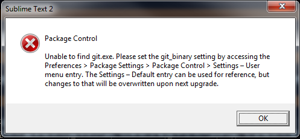
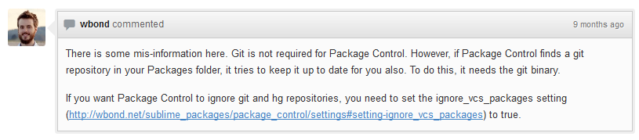

# Sublime: Unable to find git.exe错误

使用Package Control安装插件时，如果出现下面的错误提示：

> Package Control:
Unable to find git.exe. Please set the git_binary setting by accessing the Preferences > Package Settings > Package Control > Settings – User menu entry. The Settings – Default entry can be used for reference, but changes to that will be overwritten upon next upgrade.

原因在这个[帖子](https://github.com/wbond/sublime_package_control/issues/168)里已经有说明:

是因为ST2在Packages目录下发现Git Repo(你曾经用git clone的方法下载过插件)，因此ST2每次都试图为你将那个插件更新到最新的版本。想要忽略这个错误，在`Preferences -> Package Settings -> Package Control -> Settings - User`添加：

<pre>
	"ignore_vcs_packages":true
</pre>